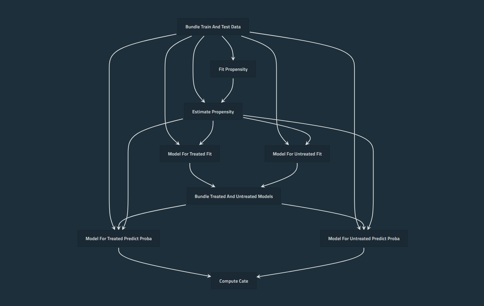
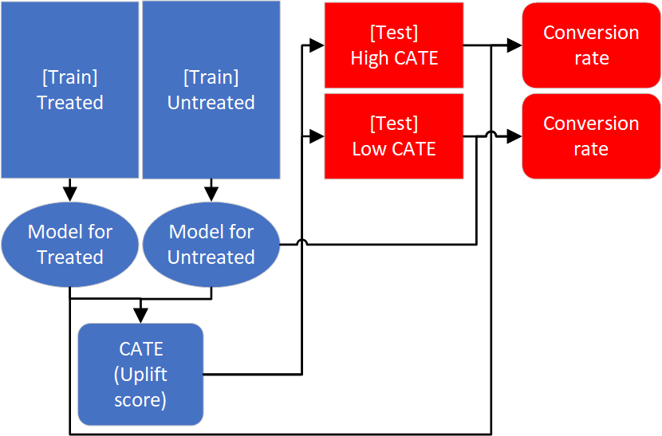
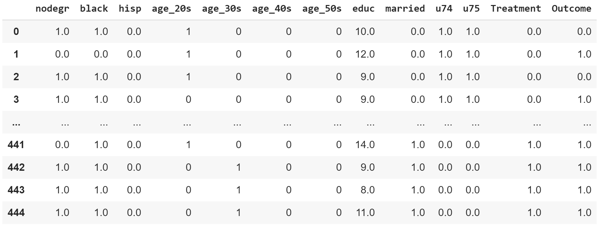

# CausalLift: Python package for Uplift Modeling in real-world business; applicable for both A/B testing and observational data

[](
https://badge.fury.io/py/causallift
)

[](
https://opensource.org/licenses/BSD-2-Clause
)
[](
https://colab.research.google.com/github/Minyus/causallift/blob/master/notebooks/demo/CausalLift_demo.ipynb
)

<p align="center">

</p>

## Introduction

If you are simply building a Machine Learning model and executing promotion campaigns to the
customers who are predicted to buy a product, for example, it is not efficient.

Some customers will buy a product anyway even without promotion campaigns (called
"Sure things").

It is even possible that the campaign triggers some customers to churn (called "Do Not Disturbs" or
"Sleeping Dogs").

The solution is Uplift Modeling.

## What is Uplift Modeling?


Uplift Modeling is a Machine Learning technique to find which customers (individuals) should be
targeted ("treated") and which customers should not be targeted.

Uplift Modeling is also known as persuasion modeling, incremental modeling, treatment effects
modeling, true lift modeling, or net modeling.

Applications of Uplift Modeling for business include:
- Increase revenue by finding which customers should be targeted for advertising/marketing
campaigns and which customers should not.
- Retain revenue by finding which customers should be contacted to prevent churn and which
customers should not.


## A famous use case?

The most famous use case of Uplift Modeling would be the 44th US president Barack Obama's 2nd
presidential campaign in 2012. Obama's team used Uplift Modeling to find which voters could be
persuaded to vote for him. Here are some articles.

- [What is ‘Persuasion Modeling’, and how did it help Obama to win the elections?](http://numrush.com/2013/06/28/what-is-persuasion-modeling-and-how-did-it-help-obama-to-win-the-elections/)
- [How Obama’s Team Used Big Data to Rally Voters](https://www.technologyreview.com/s/509026/how-obamas-team-used-big-data-to-rally-voters/)
- [How uplift modeling helped Obama's campaign -- and can aid marketers](https://searchbusinessanalytics.techtarget.com/video/How-uplift-modeling-helped-Obamas-campaign-and-can-aid-marketers)


## How does Uplift Modeling work?

Uplift Modeling estimates uplift scores (a.k.a. CATE: Conditional Average Treatment Effect or ITE:
Individual Treatment Effect). Uplift score is how much the estimated conversion rate will increase
by the campaign.

Suppose you are in charge of a marketing campaign to sell a product, and the estimated conversion
rate (probability to buy a product) of a customer is 50 % if targeted and the estimated conversion
rate is 40 % if not targeted, then the uplift score of the customer is (50–40) = +10 % points.
Likewise, suppose the estimated conversion rate if targeted is 20 % and the estimated conversion
rate if not targeted is 80%, the uplift score is (20–80) = -60 % points (negative value).

The range of uplift scores is between -100 and +100 % points (-1 and +1).
It is recommended to target customers with high uplift scores and avoid customers with negative
uplift scores to optimize the marketing campaign.


## What are the advantages of "CausalLift" package?

- CausalLift works with both A/B testing results and observational datasets.
- CausalLift can output intuitive metrics for evaluation.

## Why CausalLift was developed?

In a word, to use for real-world business.

- Existing packages for Uplift Modeling assumes the dataset is from A/B Testing (a.k.a. Randomized
Controlled Trial). In real-world business, however, observational datasets in which treatment
(campaign) targets were not chosen randomly are more common especially in the early stage of
evidence-based decision making. CausalLift supports observational datasets using a basic
methodology in Causal Inference called "Inverse Probability Weighting" based on the assumption that
propensity to be treated can be inferred from the available features.

- There are 2 challenges of Uplift Modeling; explainability of the model and evaluation. CausalLift
utilizes a basic methodology of Uplift Modeling called Two Models approach (training 2 models
independently for treated and untreated samples to compute the CATE (Conditional Average Treatment
Effects) or uplift scores) to address these challenges.

	- [Explainability of the model] Since it is relatively simple, it is less challenging to
	explain how it works to stakeholders in the business.

	- [Explainability of evaluation] To evaluate Uplift Modeling, metrics such as Qini and AUUC
	(Area Under the Uplift Curve) are used in research, but these metrics are difficult to explain
	to the stakeholders. For business, a metric that can estimate how much more profit can be
	earned is more practical. Since CausalLift adopted the Two-Model approach, the 2 models can be
	reused to simulate the outcome of following the recommendation by the Uplift Model and can
	estimate how much conversion rate (the proportion of people who took the desired action such as
	buying a product) will increase using the uplift model.

<p align="center">

</p>

<p align="center">
	CausalLift flow diagram
</p>


## Installation

- [Option 1] To install the latest release from the PyPI:

```bash
$ pip install causallift
```

- [Option 2] To install the latest pre-release:

```bash
$ pip install git+https://github.com/Minyus/causallift.git
```

- [Option 3] To install the latest pre-release without need to reinstall even after modifying the source code:

```bash
$ git clone https://github.com/Minyus/causallift.git
$ cd pipelinex
$ python setup.py develop
```

### Dependencies:

- numpy
- pandas
- scikit-learn<0.22 (sklearn==0.22 may not work.)
- easydict
- kedro>=0.15.0

### Optional:

- matplotlib
- xgboost
- scikit-optimize

### Optional for visualization of the pipeline:

- kedro-viz

## How is the data pipeline implemented by CausalLift?

### Step 0: Prepare data

Prepare the following columns in 2 pandas DataFrames, train and test (validation).

- Features
	- a.k.a independent variables, explanatory variables, covariates
	- e.g. customer gender, age range, etc.
	- Note: Categorical variables need to be one-hot coded so propensity can be estimated using
	logistic regression. [pandas.get_dummies](https://pandas.pydata.org/pandas-docs/stable/reference/api/pandas.get_dummies.html) can be used.
- Outcome: binary (0 or 1)
	- a.k.a dependent variable, target variable, label
	- e.g. whether the customer bought a product, clicked a link, etc.
- Treatment: binary (0 or 1)
	- a variable you can control and want to optimize for each individual (customer)
	- a.k.a intervention
	- e.g. whether an advertising campaign was executed, whether a discount was offered, etc.
	- Note: if you cannot find a treatment column, you may need to ask stakeholders to get the data, which might take hours to years.
- [Optional] Propensity: continuous between 0 and 1
	- propensity (or probability) to be treated for observational datasets (not needed for A/B Testing results)
	- If not provided, CausalLift can estimate from the features using logistic regression.


<p align="center">
	Example table data
</p>

### Step 1: Prepare for Uplift modeling and optionally estimate propensity scores using a supervised classification model

If the `train_df` is from observational data (not A/B Test), you can set `enable_ipw`=True so IPW (Inverse Probability Weighting) can address the issue that treatment should have been chosen based on a different probability (propensity score) for each individual (e.g. customer, patient, etc.)

If the `train_df` is from A/B Test or RCT (Randomized Controlled Trial), set `enble_ipw`=False to skip estimating propensity score.

### Step 2: Estimate CATE by 2 supervised classification models

Train 2 supervised classification models (e.g. XGBoost) for treated and untreated samples independently and compute estimated CATE (Conditional Average Treatment Effect), ITE (Individual Treatment Effect), or uplift score.

This step is the Uplift Modeling consisting of 2 sub-steps:

1. Training using train_df (Note: `Treatment` and `Outcome` are used)

2. Prediction of CATE for train_df and test_df (Note: Neither `Treatment` nor `Outcome` is used.)

### Step 3 [Optional] Estimate impact by following recommendation based on CATE

Estimate how much conversion rate will increase by selecting treatment (campaign) targets as recommended by the uplift modeling.

You can optionally evaluate the predicted CATE for train_df and test_df (Note: `CATE`, `Treatment` and `Outcome` are used.)

This step is _optional_; you can skip if you want only CATE and you do not find this evaluation step useful.


## How to use CausalLift?

There are 2 ways:
  - [Deprecated option] Use `causallift.CausalLift` class interface
  - [Recommended option] Use `causallift.nodes` subpackage with [`PipelineX`](https://github.com/Minyus/pipelinex) package

### [Deprecated option] Use `causallift.CausalLift` class interface

Please see the demo code in Google Colab (free cloud CPU/GPU environment):

[](
https://colab.research.google.com/github/Minyus/causallift/blob/master/notebooks/demo/CausalLift_demo.ipynb
)

To run the code, navigate to "Runtime" >> "Run all".

To download the notebook file, navigate to "File" >> "Download .ipynb".

Here are the basic steps to use.

```python
from causallift import CausalLift

""" Step 1. """
cl = CausalLift(train_df, test_df, enable_ipw=True)

""" Step 2. """
train_df, test_df = cl.estimate_cate_by_2_models()

""" Step 3. """
estimated_effect_df = cl.estimate_recommendation_impact()
```


### [Recommended option] Use `causallift.nodes` subpackage with [`PipelineX`](https://github.com/Minyus/pipelinex) package

Please see [PipelineX](https://github.com/Minyus/pipelinex) package and
 use [PipelineX Causallift example project](https://github.com/Minyus/pipelinex_causallift).


## How to run inferrence (prediction of CATE for new data with `Treatment` and `Outcome` unknown)?

Use the whole historical data (A/B Test data or observational data) as train_df instead of splitting into `tran_df` and `test_df`, and use the new data with `Treatment` and `Outcome` unknown as `test_df`.

This is possible because `Treatment` and `Outcome` are not used for prediction of CATE after Uplift Model is trained using `Treatment` and `Outcome`.

Please note that valid evaluation for `test_df` will not be available as valid `Treatment` and `Outcome` are not available.


## Details about the parameters

Please see [[CausalLift API reference]](https://minyus.github.io/causallift/causallift.html).


## Supported Python versions

- Python 3.5
- Python 3.6 (Tested and recommended)
- Python 3.7


## Related Python packages

- ["pylift"](https://github.com/wayfair/pylift)
[[documentation]](https://pylift.readthedocs.io/en/latest/)

	Uplift Modeling based on Transformed Outcome method for A/B Testing data and visualization of
	metrics such as Qini.

- ["EconML" (ALICE: Automated Learning and Intelligence for Causation and Economics)](https://github.com/Microsoft/EconML)
[[documentation]](https://econml.azurewebsites.net/index.html)

	Several advanced methods to estimate CATE from observational data.

- ["DoWhy"](https://github.com/Microsoft/dowhy)
[[documentation]](https://causalinference.gitlab.io/dowhy/)

	Visualization of steps in Causal Inference for observational data.

- ["pymatch"](https://github.com/benmiroglio/pymatch)

	Propensity Score Matching for observational data.

- ["Ax"](https://github.com/facebook/Ax)
[[documentation]](https://ax.dev/)

	Platform for adaptive experiments, powered by BoTorch, a library built on PyTorch

## Related R packages

- ["uplift"](https://cran.r-project.org/web/packages/uplift/index.html)

	Uplift Modeling.

- ["tools4uplift"](https://cran.r-project.org/web/packages/tools4uplift/index.html)
[[paper]](https://arxiv.org/abs/1901.10867)

	Uplift Modeling and utility tools for quantization of continuous variables, visualization of
	metrics such as Qini, and automatic feature selection.

- ["matching"](https://cran.r-project.org/web/packages/Matching/index.html)

	Propensity Score Matching for observational data.

- ["CausalImpact"](https://cran.r-project.org/web/packages/CausalImpact/index.html)
[[documentation]](https://google.github.io/CausalImpact/CausalImpact.html)

	Causal inference using Bayesian structural time-series models


## References

- Gutierrez, Pierre. and G´erardy, Jean-Yves. Causal inference and uplift modelling: A review of
the literature. In International Conference on Predictive Applications and APIs, pages 1–13, 2017.

- Athey, Susan and Imbens, Guido W. Machine learning methods for estimating heterogeneous causal
effects. Stat, 2015.

- Yi, Robert. and Frost, Will. (n.d.). Pylift: A Fast Python Package for Uplift Modeling. Retrieved
April 3, 2019, from https://tech.wayfair.com/2018/10/pylift-a-fast-python-package-for-uplift-modeling/


## Introductive resources about Uplift Modeling

- [[Medium article] Uplift Models for better marketing campaigns (Part 1)](
https://medium.com/@abhayspawar/uplift-models-for-better-marketing-campaigns-part-1-b491292e4c80
)
- [[Medium article] Simple Machine Learning Techniques To Improve Your Marketing Strategy: Demystifying Uplift Models](
https://medium.com/datadriveninvestor/simple-machine-learning-techniques-to-improve-your-marketing-strategy-demystifying-uplift-models-dc4fb3f927a2
)
- [[Wikipedia] Uplift_modelling](
https://en.wikipedia.org/wiki/Uplift_modelling
)

## License

[BSD 2-clause License](https://github.com/Minyus/causallift/blob/master/LICENSE).


## To-dos

- Improve documentation
- Clarify the model summary output including visualization
- Add examples of applying uplift modeling to more publicly available datasets
(such as [Lending Club Loan Data](https://www.kaggle.com/wendykan/lending-club-loan-data)
as [pymatch](https://github.com/benmiroglio/pymatch) did.
- Support for multiple treatments


## Contributing

Any feedback is welcome!

Please create an issue for questions, suggestions, and feature requests.
Please open pull requests to improve documentation, usability, and features against `develop` branch.

Separate pull requests for each improvement are appreciated rather than a big pull request.
It is encouraged to use:
- [Google-style docstrings](https://sphinxcontrib-napoleon.readthedocs.io/en/latest/example_google.html)
- [PEP 484 comment-style type annotation](https://mypy.readthedocs.io/en/latest/cheat_sheet.html)
although Python 2 is not supported.
- An intelligent IDE such as PyCharm or VS Code

If you could write a review about CausalLift in any natural languages (English, Chinese, Japanese,
etc.) or implement similar features in any programming languages (R, SAS, etc.), please let me
know. I will add the link here.

## Keywords to search

[English] Causal Inference, Counterfactual, Propensity Score, Econometrics

[中文] 因果推论, 反事实, 倾向评分, 计量经济学

[日本語] 因果推論, 反事実, 傾向スコア, 計量経済学

## Article about CausalList in Japanese

- https://qiita.com/Minyus86/items/07ce57a8bddc49c2bbf5

## Author:

Yusuke Minami

- [@Minyus](https://github.com/Minyus)
- https://www.linkedin.com/in/yusukeminami/
- https://twitter.com/Minyus86

## Contributors:

[@farismosman](https://github.com/farismosman)
